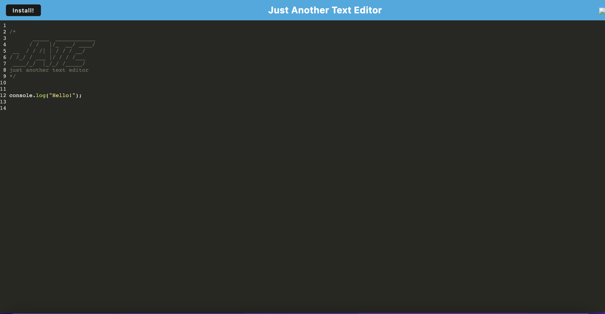
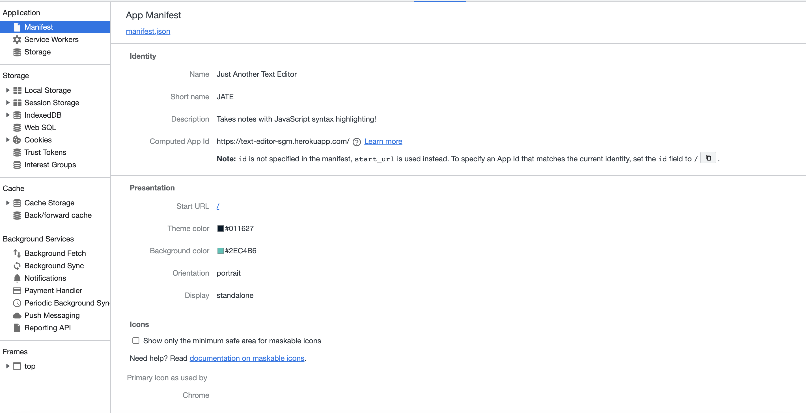
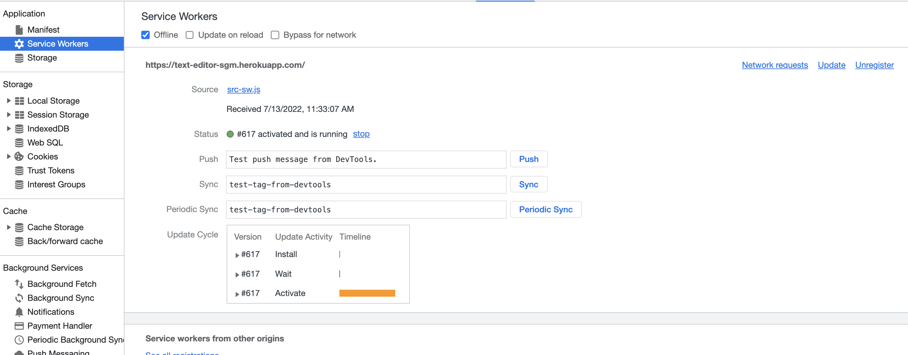
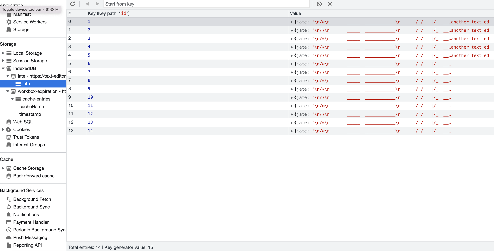

# PWA Text Editor

## Table of Contents

- [Description](#description)
- [Installation](#installation)
- [Usage](#usage)
- [Contributing](#contributing)
- [Tests](#tests)
- [License](#license)
- [Questions](#questions)

## Description

This is a text editing application that has been updated to meet PWA standards.

## Installation

To install, access the app at the [link](https://text-editor-sgm.herokuapp.com/) and click install.

## Usage

The use case for the application is for someone who wants to practice writing code and have the ability to access it on and offline.

## Contributing

To contribute, follow the installation instructions above and create a new branch to work on changes. Then when your changes are complete and the application functions as it should, request a PR and your code will be reviewed before being merged into the main branch.

## Tests

There are no tests for the application.

## License

    MIT

## Questions

- [GitHub profile](https://github.com/millersg47)
- Contact Me at millersg47@gmail.com with additional questions
